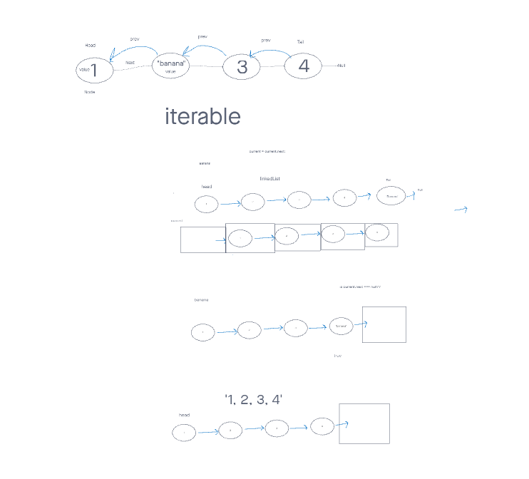

# Linked List

## Problem Domain

Create Node and LinkedList classes to for singly linked lists

## Whiteboard Process

## Approach & Efficiency

I took the approach to implement my methods with basic `for` and `while` loops to make my classes and functions accessible for humans to understand. I'd go back later, then optimize for efficiency.
