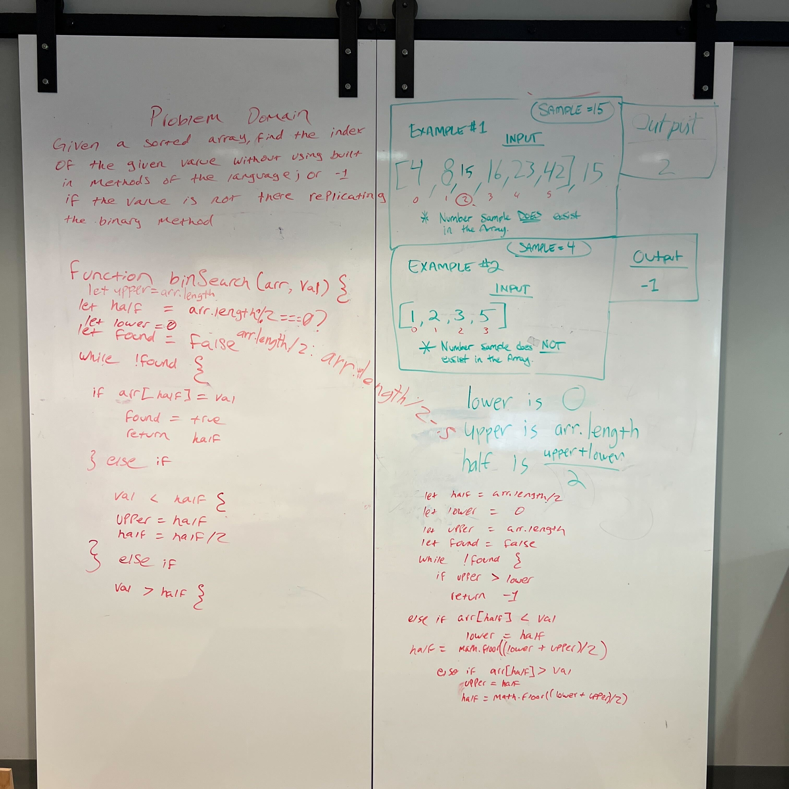

# Binary Search of Sorted Array

Given a sorted array and a search key, return the index matching the search key. If the search key isn't in the sorted array, return `-1`, instead.
Without using built-in functions or methods, create an algorithm that does a binary search to accomplish the above task.

## Whiteboard Process

[Implementation](https://replit.com/@CravenCat/401CC03#index.js)

## Approach & Efficiency

We approached the problem by first writing out what the problem domain is in plain English. Then, we drew a picture of what we imagined the inputs and outputs of the solution to look like. Then, we wrote some pseudocode to logic out what a version of an implementation of our diagram may look like.

Then Jordan Yamada,
Jeffery Smith, &
Robert McCreary, and I worked on implementing a version of the code to get a proof that our logic was sound.

We attempted to be efficient, by not searching every index, not searching indices that we've already searched, and not going out of bounds when searching the specified middle index.

## Contributions

Worked on the whiteboard drawing with:

Jeffery Smith
Amy Pierce
Jordan Yamada
Alfredo Ortiz
David Tusia
Robert McCreary

Worked on the implementation on repl.it with:

Jordan Yamada
Jeffery Smith
Robert McCreary
