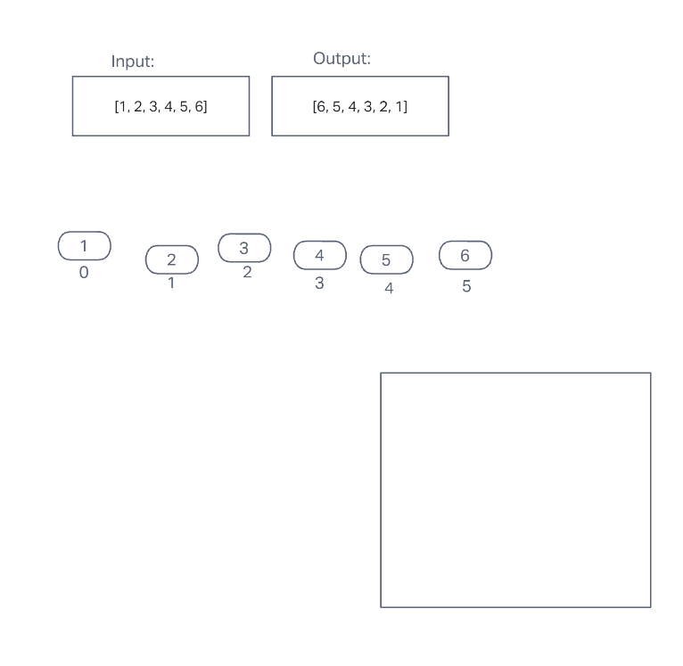

# Array Reverse

## Problem Domain

- type of array? => integers
- in-place? (return a new array, or make a new one?) =>
- inputs?
  - `[1, 2, 3, 4, 5, 6]`
- outputs?
  - `[6, 5, 4, 3, 2, 1]`
- "can I get some sample data?"
- "what are some sample data?"

# Reverse an Array
<!-- Description of the challenge -->

## Whiteboard Process
<!-- Embedded whiteboard image -->

## Approach & Efficiency
<!-- What approach did you take? Discuss Why. What is the Big O space/time for this approach? -->
