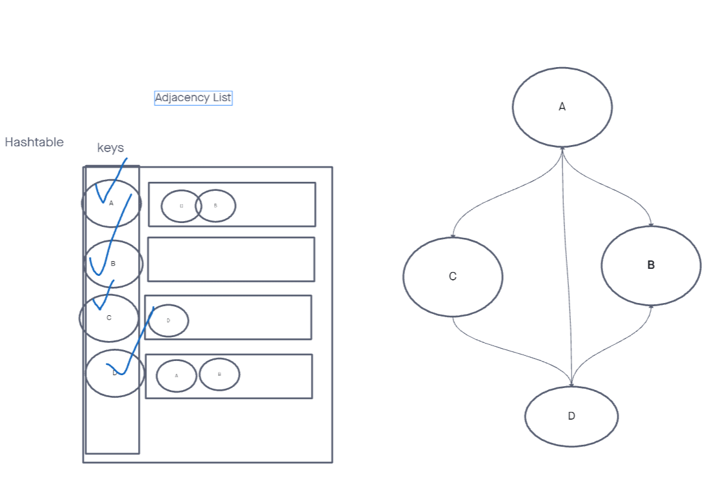

# Graph - Breadth-First

## Challenge

*Implement a breadth-first traversal on a graph.*

## API

Graph class with breadth-first traversal:

- `breadth-first`
  - Arguments: Node
  - Return: A collection of nodes in the order they were visited.
  - Display the collection

## Testing

My test suite will cover these cases:

1. Graph without any nodes
2. Graph without any connected nodes
3. Graph where all nodes can be visited

## Approach & Efficiency

I'm going to approach this challenge utilizing the 'Single-responsibility principle'. Any methods I write will be clean, reusable, and elegant.

I am going to utilize a queue to iteratively traverse the graph by visiting each node's neighbors.

The time complexity of the traversal will be O(n),
and the space complexity will be O(n).

## UML

**Bread-first Traversal**

**Adjacency List**

## Resources

1. [Virtual Whiteboard](https://projects.invisionapp.com/freehand/document/sEveKiS2A)
