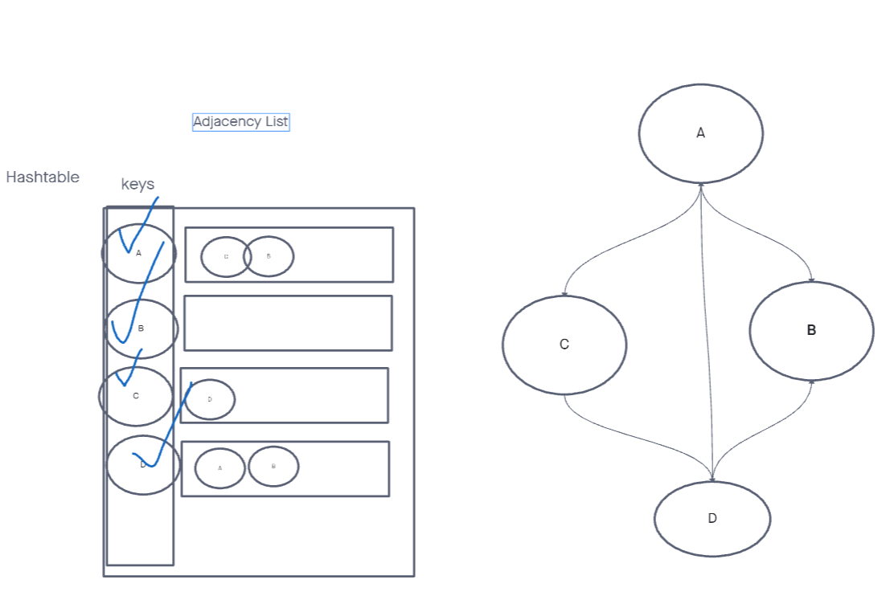

# Graph - Depth-first

## Challenge

Conduct a depth first pre-order traversal on a graph

## API

Graph class with breadth-first traversal:

- `depth-first`
  - Arguments: Node (Starting point of search)
  - A collection of nodes in their pre-order depth-first traversal order
  - Program output: Display the collection

## Testing

My test suite will cover these cases:

1. Graph without any nodes
2. Graph without any connected nodes
3. Graph where all nodes can be visited

## Approach & Efficiency

I'm going to approach this challenge utilizing the 'Single-responsibility principle'. Any methods I write will be clean, reusable, and elegant.

I am going to utilize a queue to iteratively traverse the graph by visiting each node's neighbors.

The time complexity of the traversal will be O(n),
and the space complexity will be O(n).

## Example Data

**Input:**

**Output:**
`A, B, C, G, D, E, H, F`

## UML

**Adjacency List**

## Resources

1. [Virtual Whiteboard](https://projects.invisionapp.com/freehand/document/sEveKiS2A)
