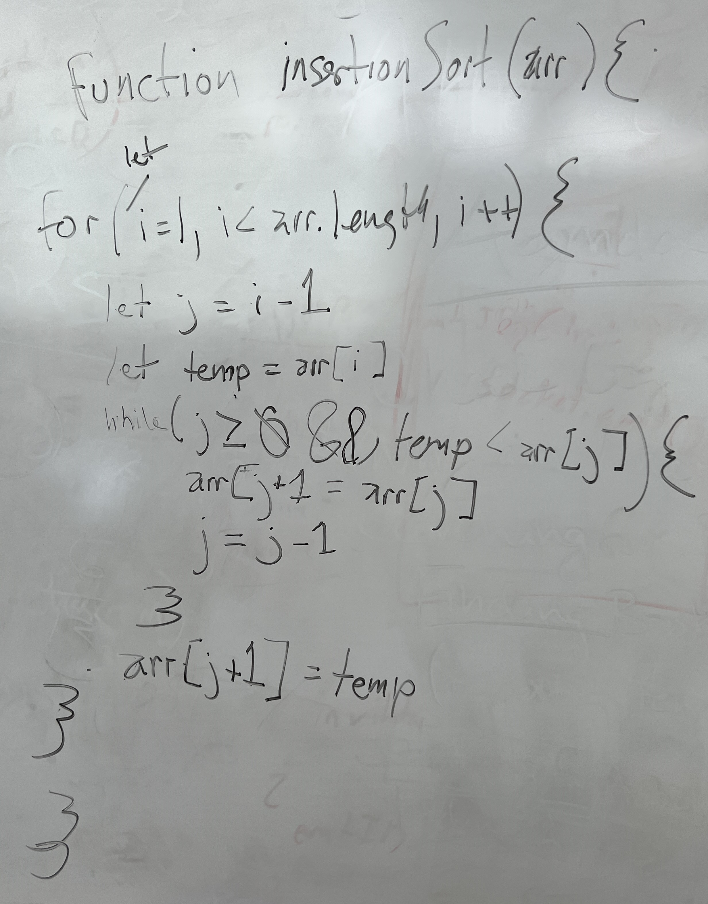

# Insertion Sort

Insertion Sort is a sorting algorithm that traverses and array, looks at two values, (i and j), and moves i down the array until it's less than j.

## Pseudocode

## Trace

## Approach & Efficiency

Time = O(n^2)
Space = O(1)

## Solution

