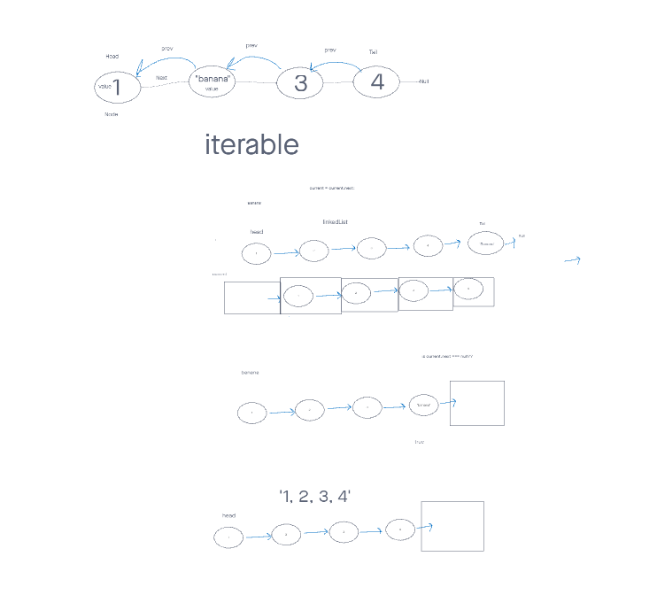

# Linked List Kth

## Problem Domain

k-th value from the end of a linked list.

### Feature Tasks

Write the following method for the Linked List class:

- kth from end
  - argument: a number, k, as a parameter.
  - Return the node’s value that is k places from the tail of the linked list.
  - You have access to the Node class and all the properties on the Linked List class as well as the methods created in previous challenges.

## Whiteboard Process

## Approach & Efficiency

I took the approach to implement my methods with basic `for` and `while` loops to make my classes and functions accessible for humans to understand. I'd go back later, then optimize for efficiency.
