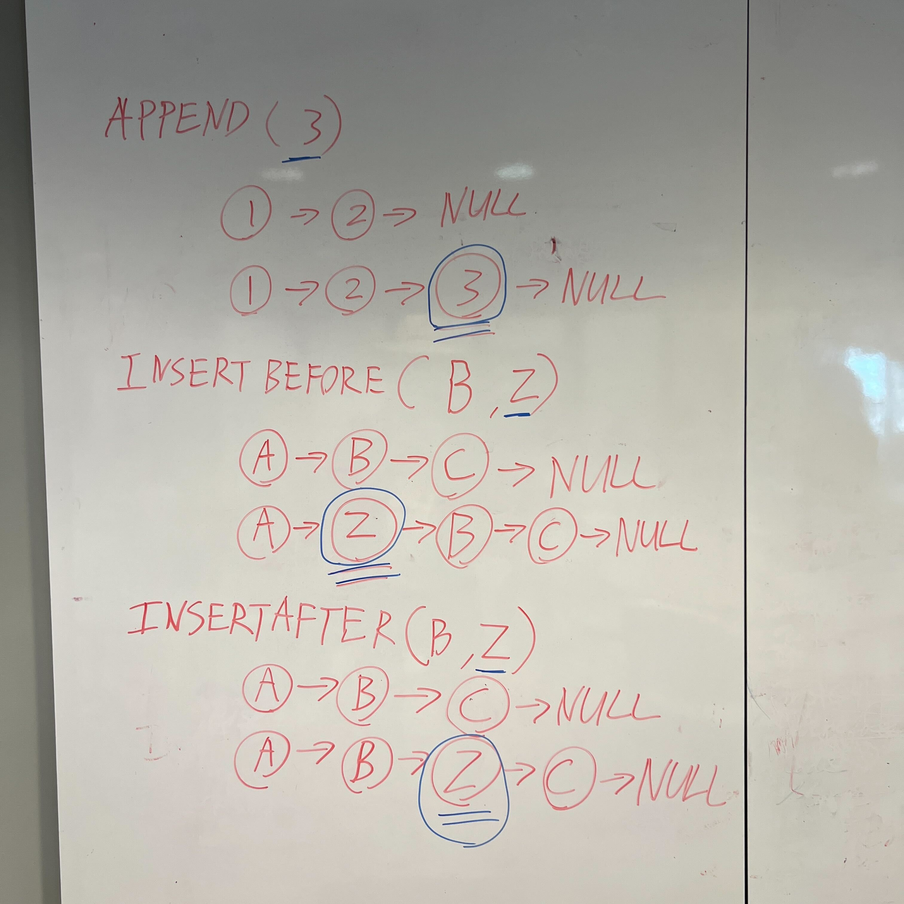
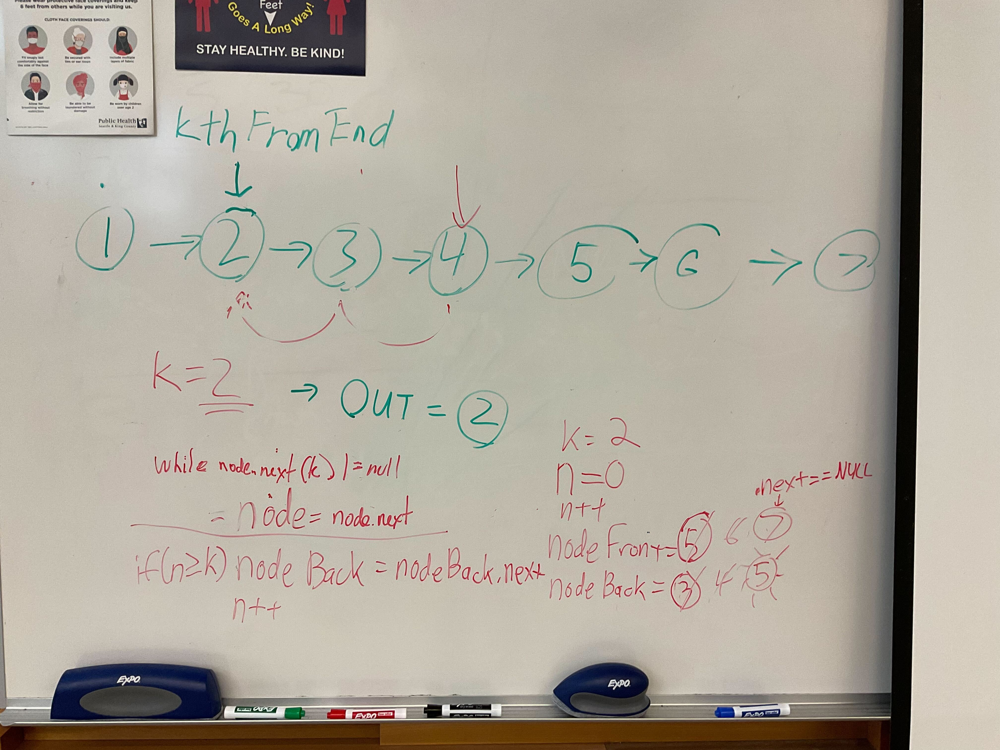
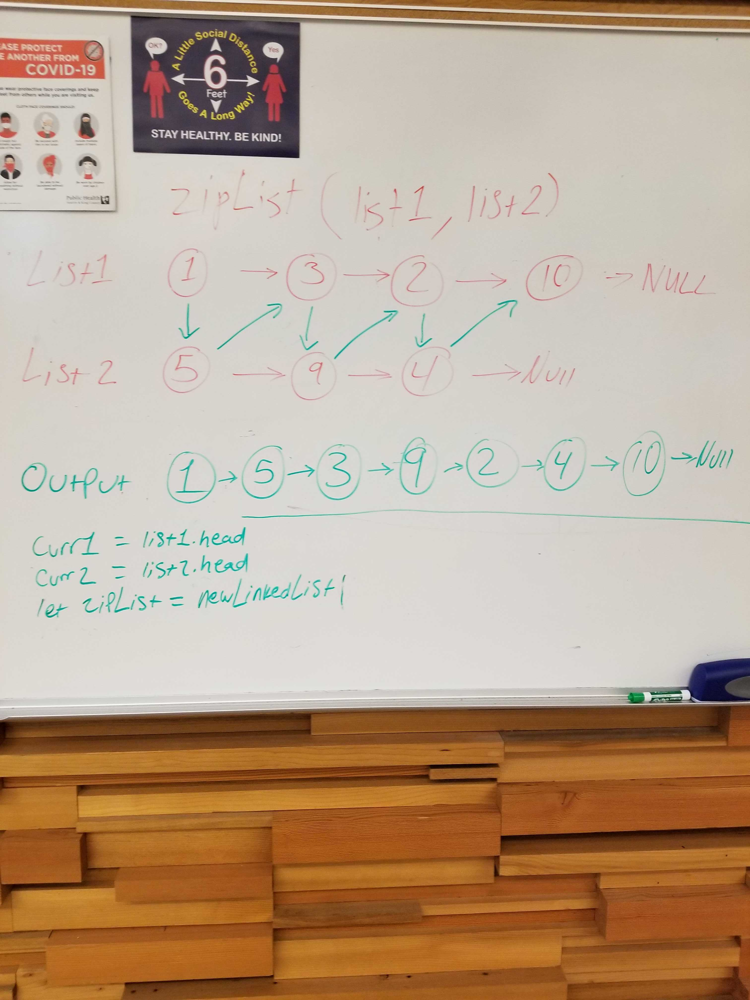
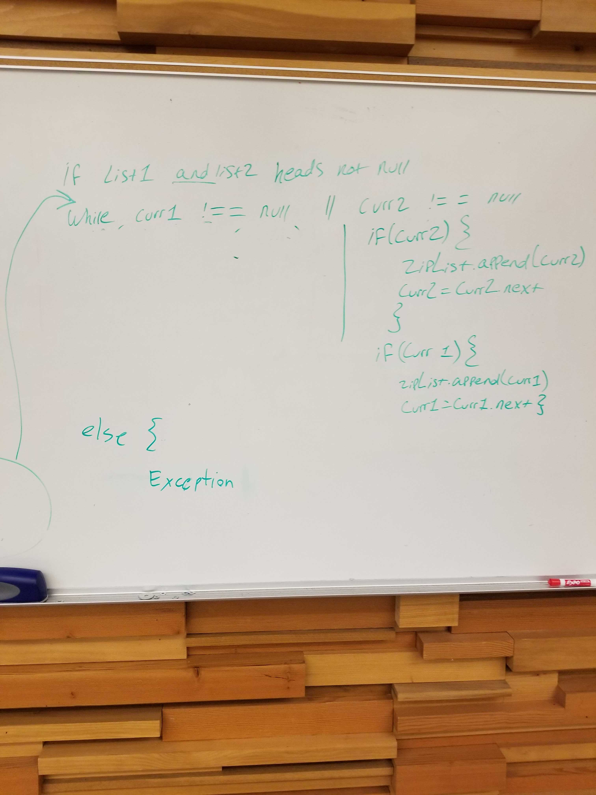

# Linked List Zip

## Problem Domain

Write a function that takes in to linked lists and interleaves the nodes into a new Linked List

### Feature Tasks

Feature Tasks
Write a function called zip lists
Arguments: 2 linked lists
Return: New Linked List, zipped as noted below
Zip the two linked lists together into one so that the nodes alternate between the two lists and return a reference to the the zipped list.
Try and keep additional space down to O(1)
You have access to the Node class and all the properties on the Linked List class as well as the methods created in previous challenges.

## Whiteboard Process

### Challenge 05

### Challenge 06

### Challenge 07

### Challenge 08

## Approach & Efficiency

I took the approach to limit the function to only a single loop, for time and space efficiency.

## Solution

| `Arg list1`      | `Arg list2` | `Output`      |
| ----------- | ----------- | ----------- |
| {1} -> {3} -> {2} -> null      | {5} -> {9} -> {4} -> null       | {1} -> {5} -> {3} -> {9} -> {2} -> {4} -> null      |
| { }   | {1} -> {5} -> {3} -> {9} -> {2} -> {4} -> null        | undefined   |
