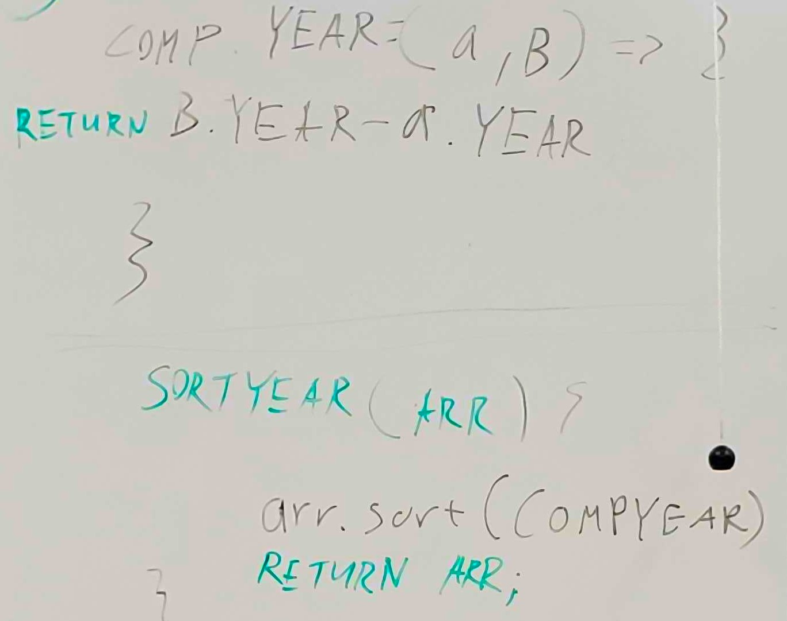
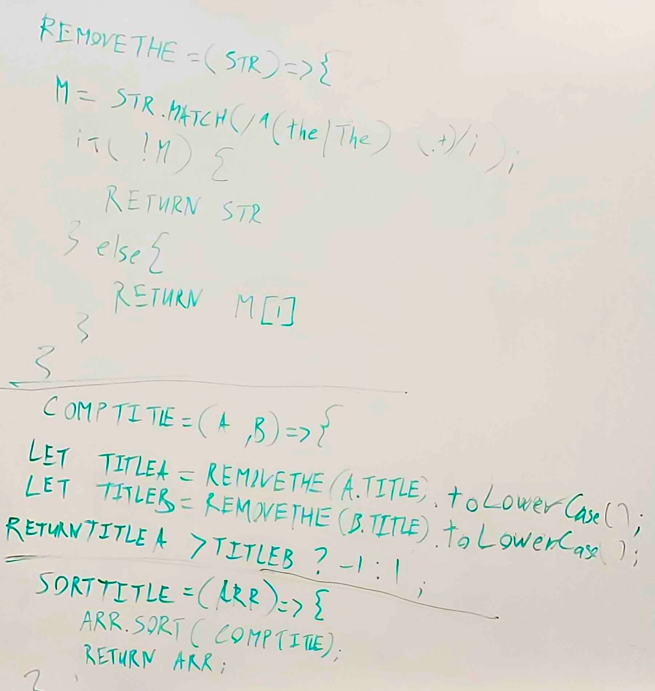
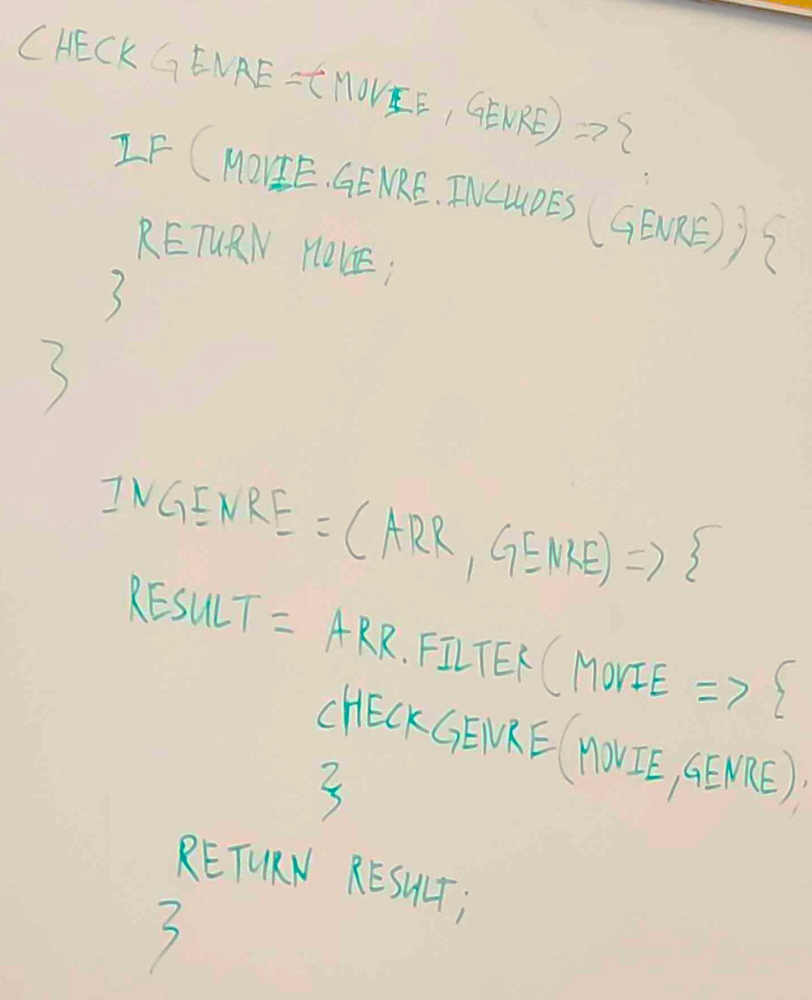

# Code Challenge 28

Implement several array sorting comparators and an array filter.

## Whiteboard

**Problem Domain:**

**Sort Year:**

**Sort Title:**

**In Genre:**

## Challenge

- Implement the functions `sortYear`, `sortTitle`, and `inGenre` in the file `sort.js`.

## Approach & Efficiency

- Extract the comparator callbacks
  - sortYear and sortTitle should both be implemented by passing a custom comparison function to the built-in sort utility.
    - the a, b, thing with the -1, 0, or 1 values
  - Export these helper functions at the top level of your file, and call them from your sortYear and sortTitle functions.
  - Import these helper functions into your test, and write tests that verify they return the appropriate comparison values (<0, 0, or >0).

## API

- Functions:
  - sortYear
    - Arguments: `movies` array
    - Sorts the input array by year, in ascending order.
  - sortTitle
    - Arguments: `movies` array
    - Sorts the input array by title, ignoring `"The "` at the beginning of titles.
  - inGenre
    - Arguments: `movies` array, `genre` string
    - Filters the input array, returning only those movies who include `genre`.

## Testing

- Execute tests while developing using `npm run watch`
  - Execute tests in CI using `npm test`-

My test suite will cover these cases:

1. can sort movies by year
2. can sort movies by title
3. can find movies by genre
