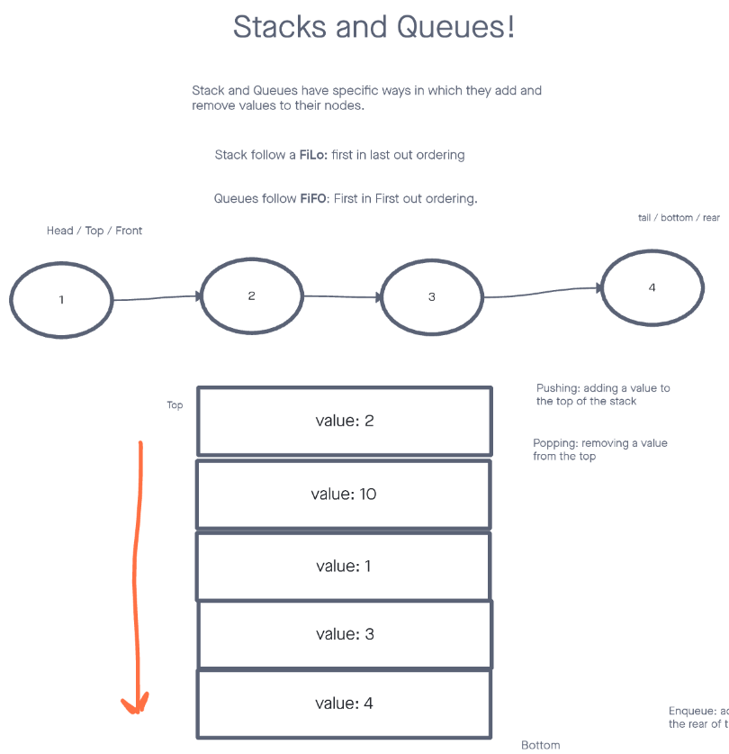
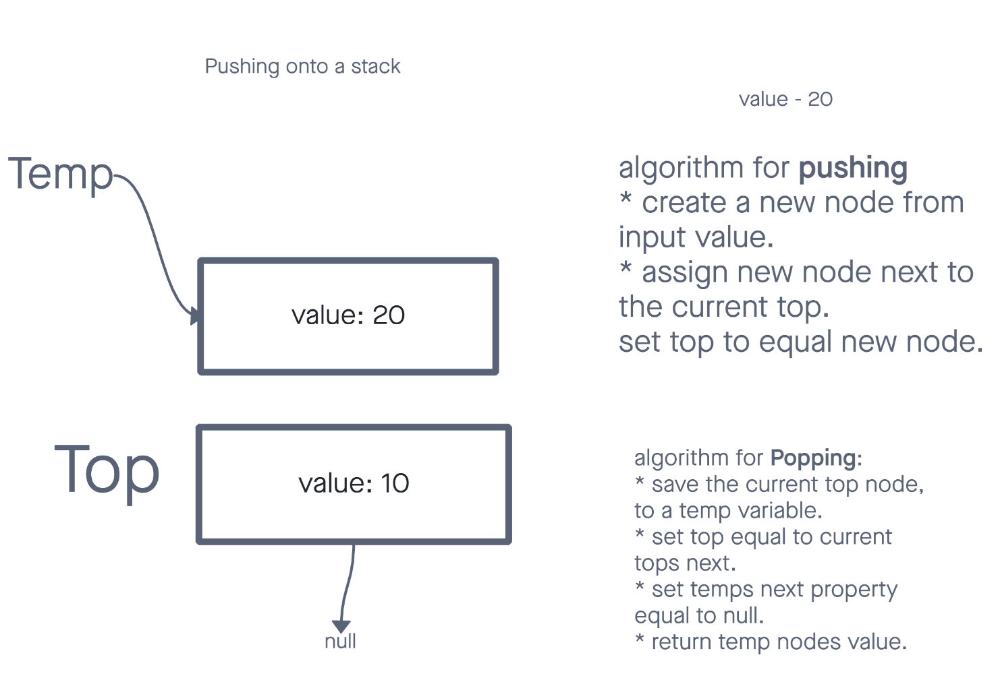
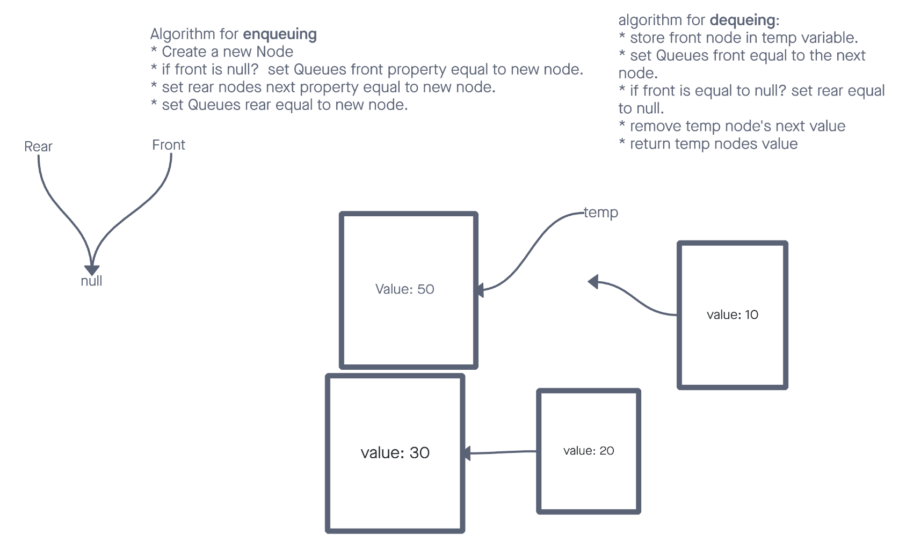

# Stacks and Queues

`Stacks` and `queues` are linear and dynamic data structures that contain `Nodes`. `Stacks` are FiLo and `Queues` are FiFo.

## Challenge

Create a `Stack` class that has a top property. It creates an empty `Stack` when instantiated.

This object should be aware of a default empty value assigned to top when the stack is created.

You have access to the `Node` class and all the properties on the `Linked List` class.

### Features

Using a `Linked List` as the underlying data storage mechanism, implement both a `Stack` and a `Queue`

#### Node

Create a `Node` class that has properties for the value stored in the `Node`, and a pointer to the next `node`.

#### Stack class

- The class should contain the following methods:

  - `push`
    - Arguments: `value`
    adds a new node with that value to the top of the stack with an O(1) Time performance.

  - `pop`
    - Arguments: none
    - Returns: the value from node from the top of the stack
    - Removes the node from the top of the stack
    - Should raise exception when called on empty stack

  - `peek`
    - Arguments: none
    - Returns: Value of the node located at the top of the stack
    - Should raise exception when called on empty stack

  - `is empty`
    - Arguments: none
    - Returns: `Boolean` indicating whether or not the stack is empty.

#### Queue class

- Create a `Queue` class that has a `front` property. It creates an empty `Queue` when instantiated.

  - This object should be aware of a default empty value assigned to `front` when the `queue` is created.
  - The class should contain the following methods:

  - `enqueue`
    - Arguments: `value`
    - adds a new node with that value to the `back` of the queue with an O(1) Time performance.

  - `dequeue`
    - Arguments: none
    - Returns: the value from `node` from the front of the `queue`
    - Removes the `node` from the front of the `queue`
    - Should raise exception when called on empty `queue`

  - `peek`
    - Arguments: none
    - Returns: Value of the `node` located at the front of the `queue`
    - Should raise exception when called on empty `stack`

  - `is empty`
    - Arguments: none
    - Returns: Boolean indicating whether or not the `queue` is empty

## Approach & Efficiency
<!-- What approach did you take? Why? What is the Big O space/time for this approach? -->

### Whiteboard

Credit to Jacob Knaack, Jordan Yamada,##and Alfredo Ortiz for contributing to this whiteboard

#### Stack

- 

#### Queue

- 

#### Push and pop

- 

#### Enqueue and dequeue

- 
