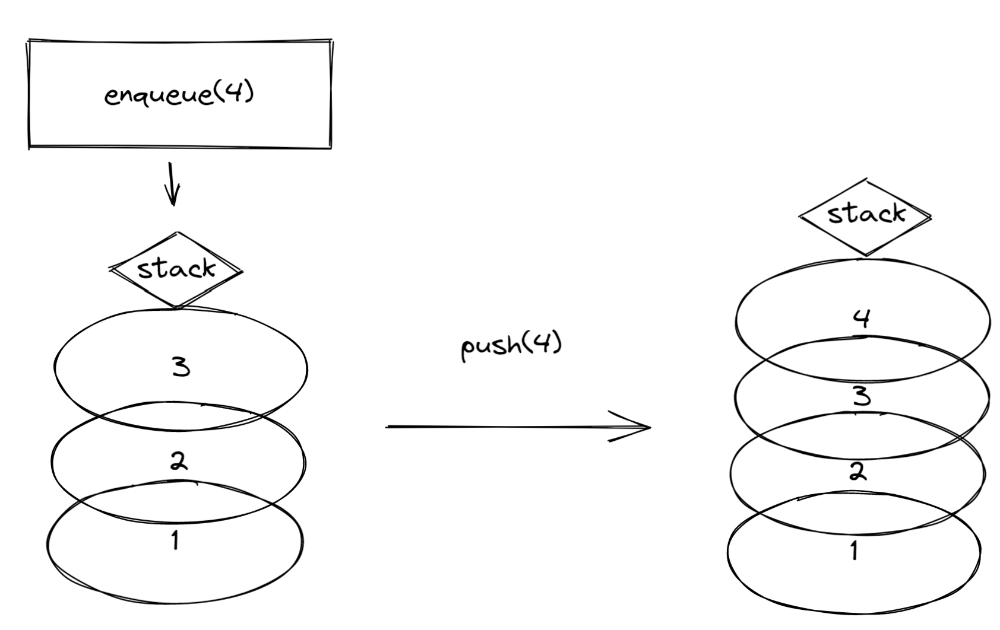
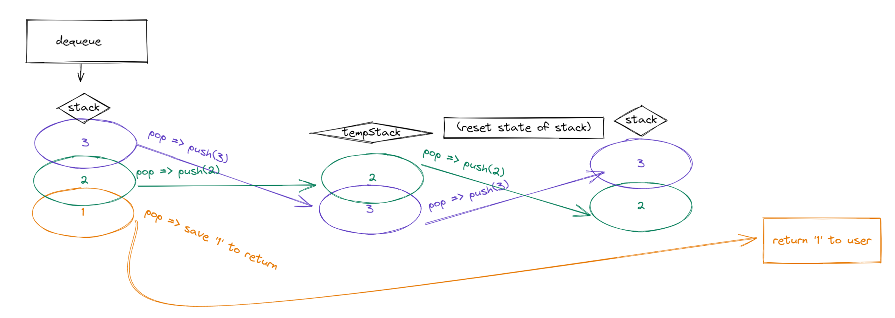

# Stack Queue Pseudo

## Challenge

Implement a pseudo-queue class that utilized two Stack class objects and Stack class methods to do FiFo enqueues and dequeues

## Approach & Efficiency

I'm going to implement two Stacks in the constructor of the pseudo-queue and shuffle nodes from one Stack to the other Stack to do enqueues and dequeues. The efficiency is pretty bad.

## Whiteboard

