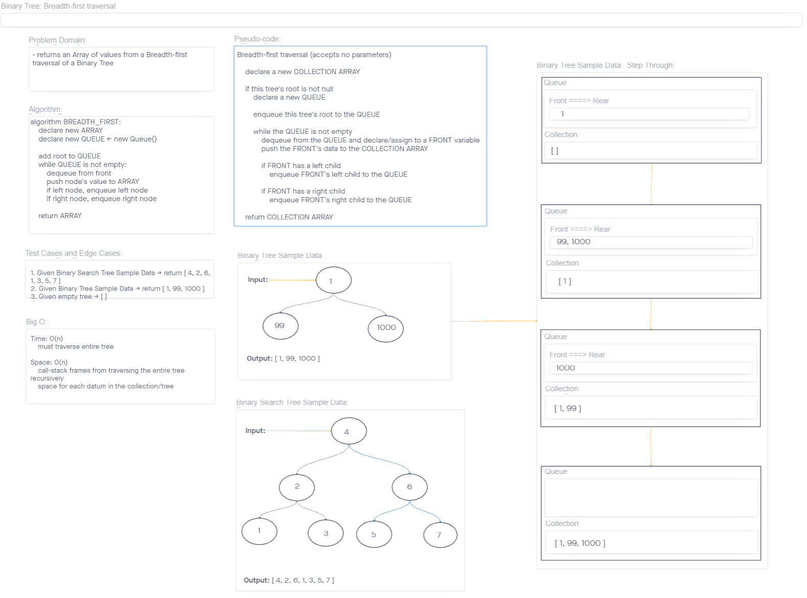

# Binary Tree Depth-first Traversal

*Breadth-first Traversal.*

## Challenge

*Return a collection of values from the input tree using a Breadth-first approach.*

## API

- **`Binary Tree` class `method`:**
  - **`breadthFirst():`**
    - Arguments: none
    - Return: `Array`: Collection of values in the input Binary Tree

## Approach & Efficiency

### Binary Tree Max UML

> 

### Big O

- **`breadthFirst()`**
  - Time: `O(n)`
    - As a traversal we must visit every node in the tree
  - Space: `O(n)`
    - The space accounts for frames added to the call-stack, as well as the resulting collection from the traversal

## Testing

My test suite covers these cases:

1. Can successfully `return a collection using a breadth-first approach` from a `Binary Tree` with values
2. Can successfully `return a collection using a breadth-first approach` from a `Binary Search Tree` with values
3. Can successfully return an `empty collection` when called on `an empty tree`
