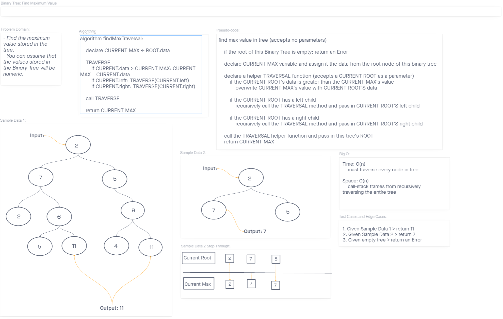

# Binary Tree Maximum Value

*Find the Maximum Value in a Binary Tree.*

## Challenge

*Find the maximum value stored in the tree. You can assume that the values stored in the Binary Tree will be numeric.*

## API

- **`Binary Tree` class `method`:**
  - **`findMax():`**
    - Arguments: none
    - Return: `number`: maximum value in Binary Tree

## Approach & Efficiency

### Binary Tree Max UML

**Input:**
>
> 

**Output:**
> `11`

### Big O

- **`findMax()`**
  - Time: `O(n)`
    - Our input tree isn't always sorted, so the entire tree must be traversed to determine the maximum value contained therein
  - Space: `O(n)`
    - The algorithm uses recursion, so `O(n)` accounts for the frames added to the call-stack

## Testing

My test suite covers these cases:

1. Can successfully `return the maximum value` from a tree with values
2. Can successfully `return the maximum value` from a `tree with duplicate maximum values`
3. Can successfully return an `Error` when called on `an empty tree`
