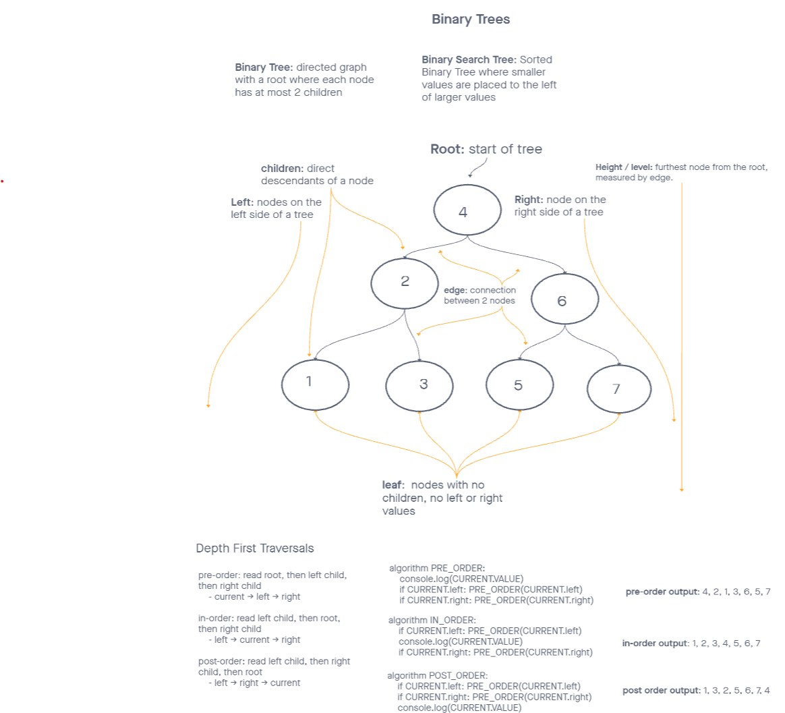

# Trees

## Challenge

*Create BinaryTree and BinarySearchTree classes with pre, in, and post-order searches, as well as 'add' and 'contains' methods to the BinarySearchTree class.*

## API

### Node

- **`Node` class properties:**
  - **`data`**: data stored in the `node`
  - **`left`**: pointer to left child `node`
  - **`right`**: pointer to right child `node`

### Binary Tree

- **Binary Tree class properties:**
  - **root**: pointer to Binary Tree's root `node`

- **Binary Tree class methods:**
  - **`pre-order:`**
    - Arguments: `node`, `array`
    - Return: collection from a pre-order traversal to `target array`
  - **`in-order:`**
    - Arguments: `node`, `array`
    - Return: collection from a in-order traversal to `target array`
  - **`post-order:`**
    - Arguments: `node`, `array`
    - Return: collection from a post-order traversal to `target array`

### Binary Search Tree

**Extends Binary Tree class properties**

- **Binary Search Tree class methods:**
  - **`Add:`**
    - Arguments: data
    - Return: nothing
    - Adds a new node with that value in the correct location in the `Binary Search Tree`
  - **`Contains`**
    - Argument: data
    - Return: Boolean indicating whether or not the `data` is in the tree at least once

## Approach & Efficiency

I took the approach to use as much recursion as I could possibly think of. I got hung up several times on how I would possible implement a recursive method within a single function for each method. I compromised by using `helper` methods for a few of my solutions, as well as adding an extra argument to a few methods to make the recursion work without throwing away or overwriting my results.

### Big O

- `Pre`, `in`, and `post-order` traversals:
  - Time: O(n)
  - Space: O(n)

- **`Add`**
  - Time: `O(log n)`
    - Since this is a BST `add`, I'd imagine this is less than O(log n) on average, because we'll be cutting down how many paths we have to search at each step by comparing our new data to the current node's data.
    - Then again, I could see this being `O(n)` if we do have to traverse the entire tree to `add` our new data in.
  - Space: `O(1)`
    - We make one new node, so is it `O(1)`? Then again, we're utilizing the call stack for recursion, so maybe it's actually `O(log n)` as well? In that case, it could also be `O(n)`.

- **`Contains`**
  - Time: `O(log n)`
    - Just like in the `add` method, we're cutting down our paths to check at each step. Just like the `add`, it could also be `O(n)`.
  - Space: `O(1)`
    - Is this one actually `O(log n)` as well, due to the call stack? Just like the `add`, it could also be `O(n`.

### Binary Tree and Binary Search Tree UML

