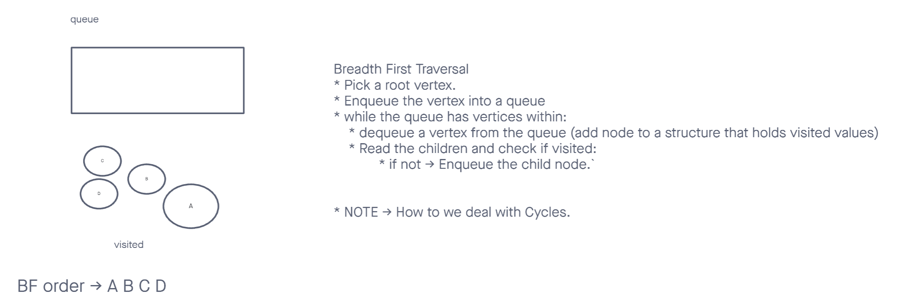
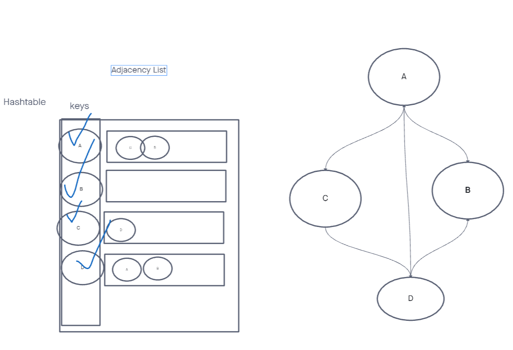

# Graph - Business Trip

## Challenge

*Given a business trip itinerary, and an Alaska Airlines route map, is the trip possible with direct flights? If so, how much will the total trip cost be?*

## API

Graph class with breadth-first traversal:

- `breadth-first`
  - Arguments: graph, array of city names
  - Return: the cost of the trip (if it’s possible) or null (if not)

## Testing

My test suite will cover these cases:

1. Graph without any nodes
2. Graph without any connected nodes
3. Graph where all nodes can be visited

## Approach & Efficiency

I'm going to approach this challenge utilizing the 'Single-responsibility principle'. Any methods I write will be clean, reusable, and elegant.

I am going to utilize a queue to iteratively traverse the graph by visiting each node's neighbors.

The time complexity of the traversal will be O(n),
and the space complexity will be O(n).

## Example Data

| Input                                | Output |
|--------------------------------------|--------|
| [Metroville, Pandora, ]              | $82    |
| [Arendelle, New Monstropolis, Naboo] | $115   |
| [Naboo, Pandora]                     | null   |
| [Narnia, Arendelle, Naboo]           | null   |

## UML

**Bread-first Traversal**

**Adjacency List**

## Resources

1. [Virtual Whiteboard](https://projects.invisionapp.com/freehand/document/sEveKiS2A)
